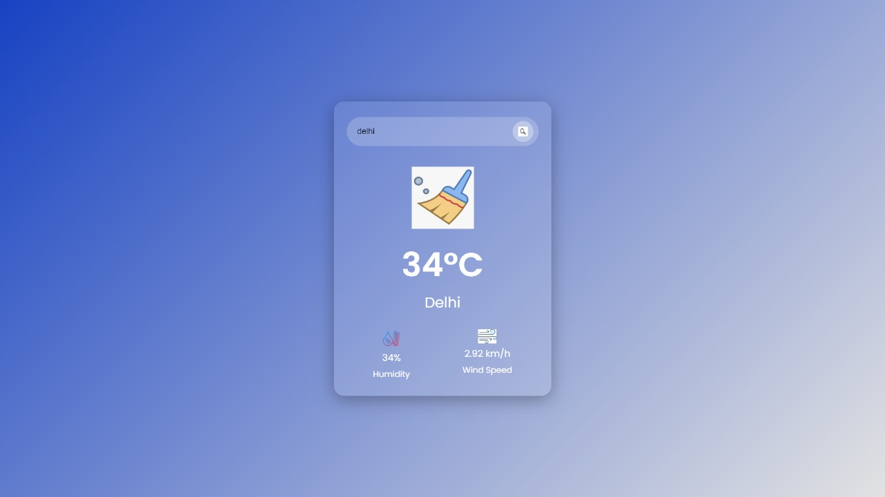
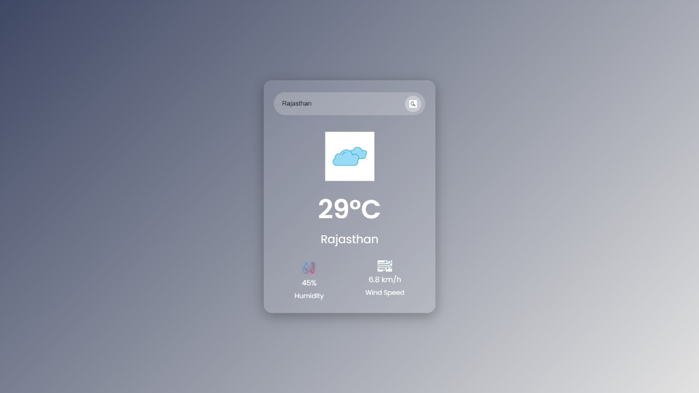

# Weather Application 🌤️

A modern and responsive weather application that provides real-time weather information for any city around the world. Built with HTML, CSS, and JavaScript, this application offers a clean and intuitive user interface.

## Features ✨

- Real-time weather data using OpenWeatherMap API
- Search functionality for any city worldwide
- Displays current temperature in Celsius
- Shows humidity percentage
- Displays wind speed
- Dynamic weather icons based on current conditions
- Responsive design that works on all devices
- Beautiful UI with glassmorphism effect

## Technologies Used 🛠️

- HTML5
- CSS3
- JavaScript
- OpenWeatherMap API
- Font Awesome Icons
- Google Fonts (Poppins)

## How to Use 🚀

1. Clone the repository
2. Get your API key from [OpenWeatherMap](https://openweathermap.org/api)
3. Replace the `apiKey` variable in `index.html` with your API key
4. Open `index.html` in your web browser
5. Enter a city name and click the search button

## Weather Conditions Supported 🌈

- Clear
- Clouds
- Rain
- Drizzle
- Mist

## Screenshot 📸

  

  

## Acknowledgments 🙏

- Weather data provided by OpenWeatherMap
- Icons from Font Awesome
- Fonts from Google Fonts
